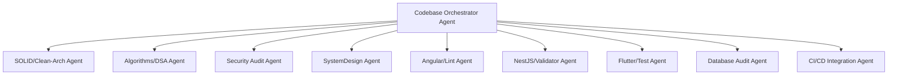
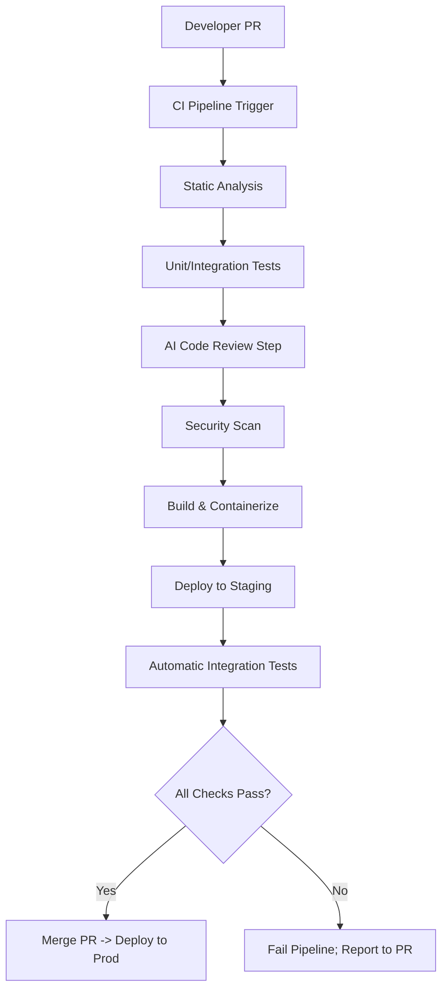
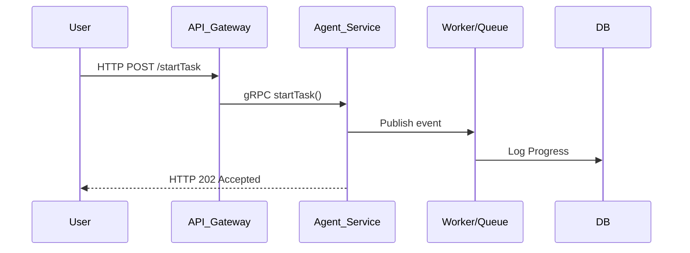
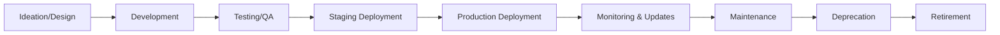

# Agents Specification (Antigravity Platform)

## Executive Summary
This document defines the Agents specification for the Antigravity enterprise workforce platform. It explains the purpose and scope of autonomous and assisted agents within the platform, and outlines target use-cases (automation, monitoring, CI/CD, code generation, testing, data pipelines, MLOps, security, infra ops, user-assistants, etc.). We categorize agent types (stateless vs stateful, orchestrator vs worker, human-in-the-loop vs autonomous) and recommend suitable software architectures and design patterns (microservices, event-driven pub/sub, actor model, serverless functions, sidecar proxies, service mesh).

We cover communications (protocols, message formats), observability (tracing, metrics, logging, health checks, circuit breakers, retries, idempotency), and security (authentication/authorization, mTLS, OAuth2/JWT, secrets management, HSM, least-privilege, audit trails, data residency, tenant isolation). We discuss data handling (schema/versioning, contracts, idempotency, backpressure, batching, streaming, change data capture) and integration with the platform stack (Angular/Flutter UI, NestJS, PostgreSQL, Redis, OCI cloud services, Kafka/Redis Streams/RabbitMQ messaging, S3/OCI Object Storage, HSM).

The specification details agent development best practices: recommended languages and frameworks (Node.js, Deno, Python, Go, Java, Rust; NestJS, FastAPI, gRPC/Protobuf, OpenTelemetry, etc.), containerization (Docker), orchestration (Kubernetes, Helm), service mesh (Istio/Linkerd), sidecars, resource limits, autoscaling, CI/CD (GitHub Actions, ArgoCD/Tekton), testing strategies (unit, integration, contract, chaos), linting/formatting, dependency management, and semantic versioning.

We define agent governance rules: lifecycle (development → deployment → updates → deprecation), registration/discovery (service registry), policy engine (e.g. OPA) for runtime policy and RBAC, multi-tenant quotas/billing, and telemetry retention. We provide coding standards and checklists (naming conventions, commit messages, PR reviews, security/performance/observability checklists, deployment/rollback/migration rules).

Finally, we list recommended agent capabilities (NLP, vision, OCR, codegen, reasoning, RAG, vector DBs/embeddings, LLM orchestration, tool use, prompt engineering) and map them to required developer skills and libraries. We compare key open-source and commercial tools across categories (language runtimes, frameworks, messaging, databases, CI/CD, observability, ML, etc.) with versions (latest stable as of 2026-07-09) and rationale. Code snippets/templates are included for agent scaffolds (NestJS/Node and FastAPI/Python), Dockerfile, Kubernetes Deployment+HPA+Service (with Istio sidecar), OpenTelemetry instrumentation, and a CI/CD pipeline (GitHub Actions). Tables compare tools (capabilities, pros/cons, license, maturity) and skills vs. capabilities. Diagrammatic flows (Mermaid) illustrate the agent architecture, request sequence, and lifecycle.

All recommendations assume a multi-tenant, Oracle Cloud Infrastructure (OCI) deployment; unspecified details are noted. Sources are official or primary wherever possible.

---

## Purpose & Scope
An agent in Antigravity is a software component or microservice that performs tasks (automated workflows, data processing, monitoring, ML inference, or user-assistance) on behalf of users or other systems. Agents may interact with users (as chatbots/assistants) or operate autonomously in the background. The Agents specification ensures consistent design and governance for all agents across the enterprise.

- **Objectives:** Enable rapid development, deployment, and management of agents for diverse use-cases while ensuring reliability, security, and maintainability.
- **Scope:** Applies to all platform agents (automation scripts, cron jobs, AI assistants, CI/CD jobs, data pipelines, monitoring/alert agents, etc.) across all services. It covers architectural patterns, communications, observability, security, data handling, development practices, governance, and tooling.
- **Multi-tenancy:** Agents must operate safely in a multi-tenant environment. Resource and data isolation between tenants is mandatory. (Data must be tagged by tenant; no cross-tenant data leaks.)

### Use-Case Examples
- **Automation:** An agent that creates user accounts, or reassigns tasks based on rules.
- **Monitoring:** An agent that continuously checks system health, logs anomalies, and triggers alerts.
- **CI/CD:** Agents (e.g. Tekton pipelines, ArgoCD apps, GitHub workflows) that build, test, and deploy code.
- **Code Generation:** Agents that integrate with LLMs to auto-generate code snippets or templates.
- **Testing:** Agents that run integration test suites, fuzz tests, or chaos injection (e.g. Chaos Monkey).
- **Data Pipelines:** Agents orchestrating ETL, streaming data into OLAP, or performing batch analytics.
- **MLOps:** Agents that train models (TensorFlow/PyTorch), run inference, update feature stores (e.g. Redis), or retrain models on schedule.
- **Security:** Agents that scan code for vulnerabilities, enforce compliance rules, or auto-remediate misconfigurations.
- **Infra Ops:** Agents managing cloud infra (spin up servers via Terraform, rotate HSM keys, garbage-collect orphan resources).
- **User-Assistants:** Chatbots or voice assistants (using LangChain, LlamaIndex, vector search) helping users query data or perform tasks.

---

## Agent Types
We classify agents by statefulness, control, and autonomy:

1. **Stateless Agents:** Treat each request independently. No memory between calls (e.g. RESTful microservices). Easy to scale horizontally behind load balancers. (Use when tasks are idempotent and small state can be passed in requests.)
2. **Stateful Agents:** Maintain conversational or session state (e.g. a long-lived workflow engine, or an AI agent with memory). Requires mechanisms for state storage (databases, caches) and careful partitioning. (Use for chatbots or complex workflows.)
3. **Orchestrator Agents:** Coordinate tasks among multiple workers or services. Example: a workflow manager that invokes other services (like Argo Workflows or a custom orchestrator).
4. **Worker Agents:** Perform individual jobs given by orchestrators. Example: a compute worker that processes a task from a queue.
5. **Human-in-the-Loop Agents:** Solicit human input or approval during processing. Example: an agent that pauses for manual QA or decision making.
6. **Autonomous Agents:** Operate continuously without human intervention, possibly with AI-driven decision logic. Example: an anomaly-detection agent that automatically remediates issues based on learned policies.

*Agents often combine these roles (e.g. an agent may be stateful and autonomous). Architectural patterns should match the agent’s type: stateless agents fit microservices best, stateful agents may use actor-model frameworks or external state stores, orchestrators may use workflow engines or serverless orchestration, etc.*

---

## Architecture & Patterns
Agents should follow cloud-native, microservices architecture and established patterns:

- **Microservices:** Each agent runs in its own container/process, with a narrow API boundary. Use APIs (REST/gRPC/WebSocket) and message-passing for communication.
- **Event-Driven (Pub/Sub):** Use message brokers (Kafka, RabbitMQ, Redis Streams) for decoupling. Agents subscribe to topics/queues and react to events (e.g. Kafka topics for data pipelines). This enables asynchronous, resilient workflows.
- **Serverless Functions:** For sporadic tasks or simple logic, agents can be implemented as FaaS (e.g. OCI Functions or AWS Lambda via OCI). Useful for bursty workloads or integration triggers.
- **Sidecar Pattern:** To add functionality (logging, metrics, network proxy, actor runtime) without modifying agent code, run sidecar containers (e.g. Envoy sidecar for service mesh) in the same pod. E.g. running Dapr sidecars to provide actor model or pub/sub features.
- **Service Mesh:** Deploy Istio or Linkerd to manage service-to-service communication, mTLS, traffic policies, and observability. With a mesh, agents need not handle networking/auth; the mesh enforces mTLS and can inject sidecar proxies automatically.
- **Actor Model:** For highly stateful or large-scale concurrent agents, consider actor frameworks (e.g. Dapr Actors, Spawn on BEAM, or Orleans in .NET). Actors encapsulate state and concurrency per entity, simplifying stateful logic.
- **Containerization:** All agents run as Docker containers, orchestrated by Kubernetes. Base images should be minimal (e.g. distroless or Alpine if suitable) for security and performance.

---

## Communication & Formats
Agents typically communicate via:

- **HTTP/REST:** JSON/HTTP APIs for human-readable requests/responses (suitable for UI or external integrations).
- **gRPC:** Protobuf/gRPC for high-performance, contract-first APIs between internal services. Good for strict schemas and polyglot support.
- **Message Queues:** Kafka (event streams), RabbitMQ (message queues), or Redis Streams. Choose based on pattern: Kafka for large-scale streaming/retention and fan-out; RabbitMQ for work-queues and complex routing; Redis Streams for light-weight pub/sub and stream processing.
- **Event Formats:** Standardize on JSON or Avro for messages; use Protobuf for binary efficiency when using gRPC. All event schemas should be versioned.

---

## Observability
Instrument all agents with modern observability tools:

- **Tracing:** Use OpenTelemetry to trace requests across agents. Each agent should create spans on entry and propagate context downstream. Export traces to Jaeger or Zipkin, queryable via Grafana (Tempo) or Jaeger UI.
- **Metrics:** Expose Prometheus-format metrics from each agent (counter/gauge/histogram). Use client libraries (Prometheus SDK) or OpenTelemetry Metrics. Prometheus scrapes or pulls metrics; Grafana dashboards visualize them. Monitor key metrics (request rates, latency percentiles, error rates, queue sizes, resource usage).
- **Logging:** Use structured, centralized logging. All agents should log in JSON (key-value), including request IDs and trace IDs. Ship logs to a central store (Elasticsearch/Opensearch or cloud log service).
- **Health Checks:** Implement Kubernetes Liveness and Readiness probes (HTTP or TCP checks) to signal healthy status. Leverage frameworks’ built-ins (e.g. NestJS Terminus for health checks).
- **Resilience Patterns:** Implement circuit breakers and retries for downstream calls. For example, use Resilience4j or Istio Retry policies. On repeated failures, breaker opens to prevent cascading errors. Use idempotency keys for retry safety.
- **Retries & Idempotency:** For transient errors (network/db issues), retry with backoff. Ensure handlers are idempotent: use unique request IDs or deduplication store (e.g. Redis) so repeat requests don’t cause duplicate effects.
- **Backpressure:** If an agent is slow, use async processing (message queues) or reactive streams (gRPC back-pressure or Kafka consumer lag awareness). Do not block callers indefinitely.
- **Circuit Breakers & Fallbacks:** When a downstream service is failing, circuit-break to a fallback behavior (e.g. default response or degraded mode). Tools: Istio’s circuit breaker, or libraries like Hystrix/Polly/Resilience4j.

### Architecture Flow
```mermaid
flowchart LR
  subgraph K8sCluster
    UI[Angular/Flutter UI] -->|HTTP| APIGw[API Gateway/BFF] 
    APIGw -->|gRPC/HTTP| AgentSvc[Agent Service (NestJS/FastAPI)] 
    AgentSvc -->|publish| Kafka[(Kafka)] 
    Kafka --> WorkerA[Worker Agent A]
    Kafka --> WorkerB[Worker Agent B]
    WorkerA -->|writes| Postgres[(PostgreSQL)]
    WorkerB -->|reads/writes| Redis[(Redis Cache)]
  end
  subgraph Platform Services
    Postgres ---|backup| S3[(OCI Object Storage)]
    Redis ---|replication| RedisReplica[(Redis)]
    Kafka ---|mirror| KafkaMirror[(Kafka)]
  end
```
*Figure: Sample agent architecture. UI calls API gateway, which invokes agent service. Agents use Kafka pub/sub; workers interact with Postgres/Redis. All components run in a Kubernetes cluster with service mesh.*

---

## Security
Agents operate on sensitive data and across tenants, so follow zero-trust principles:

- **Authentication (AuthN):** Delegate authN to a central Identity Provider (e.g. Keycloak, Auth0, or OCI IAM). Use OAuth 2.0 / OpenID Connect (OIDC) for user tokens. For service-to-service, use mTLS with client certificates or issue machine tokens via PKI. Each agent verifies JWTs or mTLS certs presented by callers. Do not hard-code credentials.
- **Authorization (AuthZ):** Implement RBAC at multiple levels:
  - *API Level:* Agents enforce roles/permissions in their APIs (e.g. via a guard or policy engine). Tokens contain scopes or roles.
  - *Kubernetes Level:* Use Kubernetes RBAC for who can deploy or administer agent pods.
  - *Policy Engine:* Use Open Policy Agent (OPA) or Envoy ACLs to centrally define complex policies (multi-tenant isolation, ACLs) and push them to agents.
- **mTLS:** Service mesh (Istio/Linkerd) enforces mutual TLS for all inter-agent communication, ensuring authenticity and encryption in transit.
- **OAuth2/JWT:** Use JWTs signed by a strong key (preferably rotated via HSM-backed Vault). Agents validate token signatures and expirations. OAuth scopes limit agent access (least privilege).
- **Secrets Management:** Store secrets (API keys, DB creds) in a dedicated secrets manager (HashiCorp Vault or OCI Vault). Do not store secrets in code or repo. Agents retrieve secrets at runtime (e.g. via sidecar injection or Vault agent). If HSM is available, use it for root key storage and cryptographic operations.
- **Least Privilege:** Agents run under non-root OS users. Capabilities and network access are minimized (e.g. disable admin APIs unless needed). Cloud roles/VM profiles are scoped to only necessary resources.
- **Audit Trails:** Log all sensitive operations (login attempts, admin actions) to an immutable audit log. For example, Vault’s audit logging, Kubernetes audit logs, and agent application logs to a secure central store.
- **Data Residency & Encryption:** For multi-tenant data, ensure encryption at rest (e.g. encrypted disks, S3 buckets). Maintain data locality as required by regulations (e.g. EU data stays in EU region). Tag data by tenant and check tenant boundaries in queries.
- **Tenant Isolation:** Logical isolation (namespaces, DB schemas, or row-level tenant IDs) to prevent cross-tenant access. Kubernetes namespaces per tenant or API Gateway tenancy checks.

---

## Data Handling
- **Schemas & Contracts:** Define clear data schemas (JSON Schema, Protocol Buffers, or Avro) for all messages and APIs. Version schemas to enable backward compatibility (use semantic versioning). For APIs, use Contract-First design with OpenAPI/Swagger or gRPC Protobuf definitions.
- **Versioning:** Tag Docker images and APIs with semantic versions. Avoid breaking changes; if needed, bump MAJOR and support old clients temporarily.
- **Idempotency:** For operations that may be retried, require an idempotency key in the request. Agents check if an operation with the same key has already been applied to avoid duplicates.
- **Backpressure and Batching:** When processing streams, use consumer pacing (Kafka consumer groups with backpressure) or message acknowledgments to avoid overload. Batch small messages into bulk operations when possible (e.g. DB batch inserts).
- **Streaming & CDC:** For data pipelines, use Kafka or change-data-capture (CDC) tools (e.g. Debezium) to stream DB changes. Agents consuming streams should be fault-tolerant to at-least-once delivery and track offsets externally.
- **Transactional Boundaries:** Agents should design idempotent transactions. Avoid distributed transactions; prefer eventual consistency or Saga patterns for multi-step ops.
- **Data Contracts:** Public-facing agents have APIs with strict input validation. Never trust input blindly.
- **Secure Data Handling:** If handling PII or medical data, ensure encryption, access logging, and anonymization as required by policy.

---

## Integration with Platform Stack
- **Front-end:** Agents providing user interaction can expose REST/gRPC endpoints consumed by Angular (for web) or Flutter (for mobile). Design APIs suitable for these UIs. Follow style guides.
- **NestJS:** Recommended Node.js framework for building agent services (v11.x). Supports TypeScript, dependency injection, and OpenTelemetry integration. Use for REST/gRPC APIs and background tasks.
- **FastAPI:** For Python agents, use FastAPI (v0.139.0) for high-performance async services. Auto-generates OpenAPI docs.
- **Databases:** PostgreSQL (v18.x) for relational data. Flyway (v12.x) or Liquibase (v5.x) for schema migrations. Redis (v8.8.x) for caching, distributed locks, or in-memory state.
- **Messaging:** Apache Kafka (v4.3.1) as the primary event backbone for high-throughput streaming. RabbitMQ (v4.3.x) for traditional message queues. OCI Streaming Service if on Oracle Cloud.
- **Object Storage:** OCI Object Storage (S3-compatible) for large files, logs, and backups.
- **Cloud & Infra:** OCI (Oracle Cloud) with Kubernetes (OKE) and OCI Vault/HSM for secrets.
- **Service Mesh:** Istio (v1.20+) or Linkerd for ingress/egress control.

---

## Agent Development Best Practices
### Languages & Frameworks
- **TypeScript/Node.js:** For web/backend agents. Use NestJS (v11.x).
- **Python:** For AI/ML agents or glue logic. Use FastAPI (v0.139.x).
- **Go:** For high-performance or systems agents (v1.26.5).
- **Java:** For enterprise services (v26.x).
- **Rust:** For performance-critical agents (1.96.x).
- **Deno:** Secure JS/TS script execution (v2.9.1).

### DevOps & CI/CD
- **Containerization:** Package agents as Docker containers (distroless/Alpine).
- **Kubernetes Orchestration:** Deployments, StatefulSets, CronJobs. Helm (v4.x) or GitOps (ArgoCD).
- **Service Mesh & Sidecars:** Inject Istio proxies.
- **Autoscaling:** Define HorizontalPodAutoscaler based on CPU/custom metrics.
- **CI/CD Pipelines:** GitHub Actions or Tekton. Automate lint, test, build, push, deploy.
- **Testing:** Unit (Jest/PyTest), Integration (TestContainers), Contract (Pact), Chaos (Chaos Mesh).
- **Linting & Formatting:** ESLint/Prettier, flake8/black, gofmt, etc.
- **Semantic Versioning:** SemVer 2.0.0.
- **Security in CI:** GitHub Secrets/OCI Vault, Container Scanning (Clair, Trivy).

### Example Scaffolding

#### NestJS Agent (TypeScript)
```typescript
// src/main.ts
import { NestFactory } from '@nestjs/core';
import { AppModule } from './app.module';
import { FastifyAdapter } from '@nestjs/platform-fastify';
import { DocumentBuilder, SwaggerModule } from '@nestjs/swagger';
import { TerminusModule } from '@nestjs/terminus';

async function bootstrap() {
  const app = await NestFactory.create(AppModule, new FastifyAdapter());

  const opts = new DocumentBuilder()
    .setTitle('Agent Service')
    .setDescription('Agent API')
    .setVersion('1.0.0')
    .build();
  const doc = SwaggerModule.createDocument(app, opts);
  SwaggerModule.setup('docs', app, doc);

  app.connectMicroservice({ strategy: TerminusModule });
  await app.listen(3000);
}
bootstrap();
```

#### FastAPI Agent (Python)
```python
# main.py
from fastapi import FastAPI
from pydantic import BaseModel
import uvicorn

app = FastAPI(title="Agent Service", version="1.0.0")

class RequestPayload(BaseModel):
    data: str

@app.get("/healthz")
async def health_check():
    return {"status": "ok"}

@app.post("/process")
async def process(payload: RequestPayload):
    result = payload.data.upper()
    return {"result": result}

if __name__ == "__main__":
    uvicorn.run(app, host="0.0.0.0", port=8000)
```

#### Dockerfile
```dockerfile
FROM node:26-alpine AS build
WORKDIR /app
COPY package*.json ./
RUN npm install
COPY . .
RUN npm run build

FROM node:26-alpine
WORKDIR /app
COPY --from=build /app/dist ./dist
COPY --from=build /app/node_modules ./node_modules
USER node
ENTRYPOINT ["node", "dist/main.js"]
```

---

## Governance & Policies
- **Lifecycle Management:** Design → Dev → QA → Staging → Production → Deprecated → Retired.
- **Registration & Discovery:** Service registry or Kubernetes DNS.
- **Policy Engine:** Centralize policies (OPA).
- **RBAC & Quotas:** Enforce RBAC, cluster roles, resource quotas, API rate-limits.
- **Cost/Billing:** Tag workloads with cost centers/tenant IDs.
- **Telemetry Retention:** Configured per tenant policy (e.g. 30d metrics, 90d logs).
- **Audit & Compliance:** Review audit logs for anomalies.

### Agent Development Rules (Antigravity Standards)
- **Coding Standards:** Follow Angular Style Guide, Effective Dart, Airbnb TypeScript, PEP8.
- **Naming Conventions:** kebab-case for APIs, PascalCase for classes, camelCase for variables.
- **Commit Messages:** Conventional Commits.
- **Pull Request Checklist:** Code, tests, lint, docs, peer review.
- **Security Checklist:** SAST, dependency checks, HTTPS, JWT, CORS.
- **Performance Checklist:** Benchmark, limits, memory leaks profiling.
- **Observability Checklist:** Instrumentation, metrics, contextual logging.
- **Deployment Checklist:** Manifest syntax, staging test, canary/blue-green.
- **Rollback Strategy:** Image tagging, reversible DB migrations.

---

## Agent Capabilities & Skills Matrix
| Capability | Required Skills | Libraries/Tools |
|---|---|---|
| NLP / Text Processing | Python, PyTorch/TensorFlow, SpaCy, NLTK | Hugging Face, spaCy, NLTK |
| Computer Vision / OCR | Python, C++, OpenCV, Tesseract | OpenCV, Tesseract, PIL |
| Code Generation | Python, Node.js, LLMs, prompting | OpenAI Codex, LangChain |
| Reasoning & Planning | Python, LLMs, symbolic logic | LangChain, LlamaIndex, GPT-4 |
| RAG | Python, vector DBs, embeddings | Pinecone, Milvus, Weaviate, OpenSearch |
| LLM Orchestration | Python, TypeScript, async | LangChain, LlamaIndex, OpenAI |
| Tool Use (APIs/CLI) | Shell, Python, Node, API int. | LangChain Tools, custom connectors |
| Workflow Automation | DevOps, Kubernetes, Tekton | Tekton, Argo Workflows, GH Actions |
| Security/Governance | DevSecOps, OPA, policy-as-code | OPA, Vault, mTLS |
| Data Engineering | SQL, streaming, Kafka | Kafka, Debezium, Beam/Flink |

---

## AI Agent Ecosystem & Audit Governance

### Agent Hierarchy


### Example CI/CD Pipeline Integration


### Sample Audit Report Format
```json
{
  "overall_score": 96.5,
  "scores": {
    "architecture": 98,
    "security": 94,
    "performance": 95,
    "maintainability": 97,
    "readability": 100,
    "documentation": 93,
    "test_coverage": 92
  },
  "risk_level": "Low",
  "issues": [
    {
      "file": "app/user.controller.ts",
      "line": 42,
      "category": "Security",
      "severity": "High",
      "message": "Possible SQL injection; use parameterized query."
    },
    {
      "file": "db/connection.ts",
      "line": 15,
      "category": "BestPractices",
      "severity": "Medium",
      "message": "Missing connection timeout settings."
    }
  ]
}
```

---

## Sequence & Lifecycle
### Request Sequence


### Lifecycle States


*This specification is subject to periodic updates as technologies evolve. All AI subagents reading this file must strictly adhere to the technology stack constraints, governance workflows, and architectural rules documented above.*
